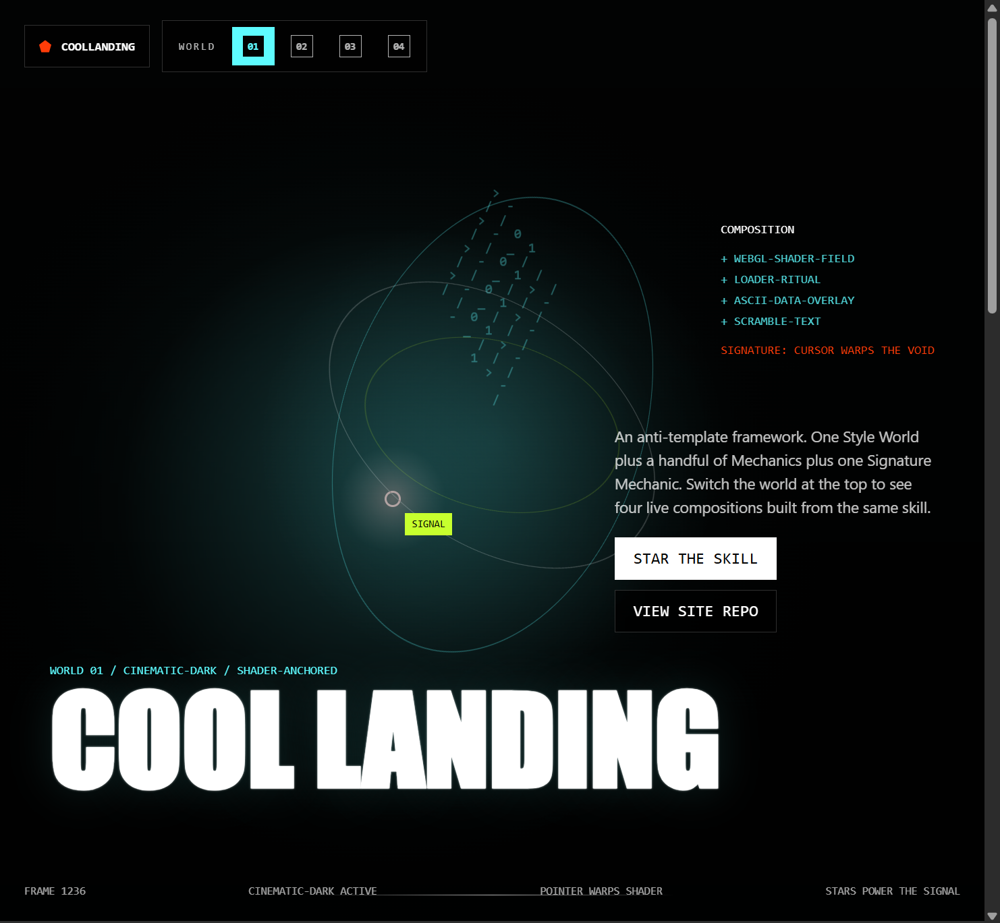
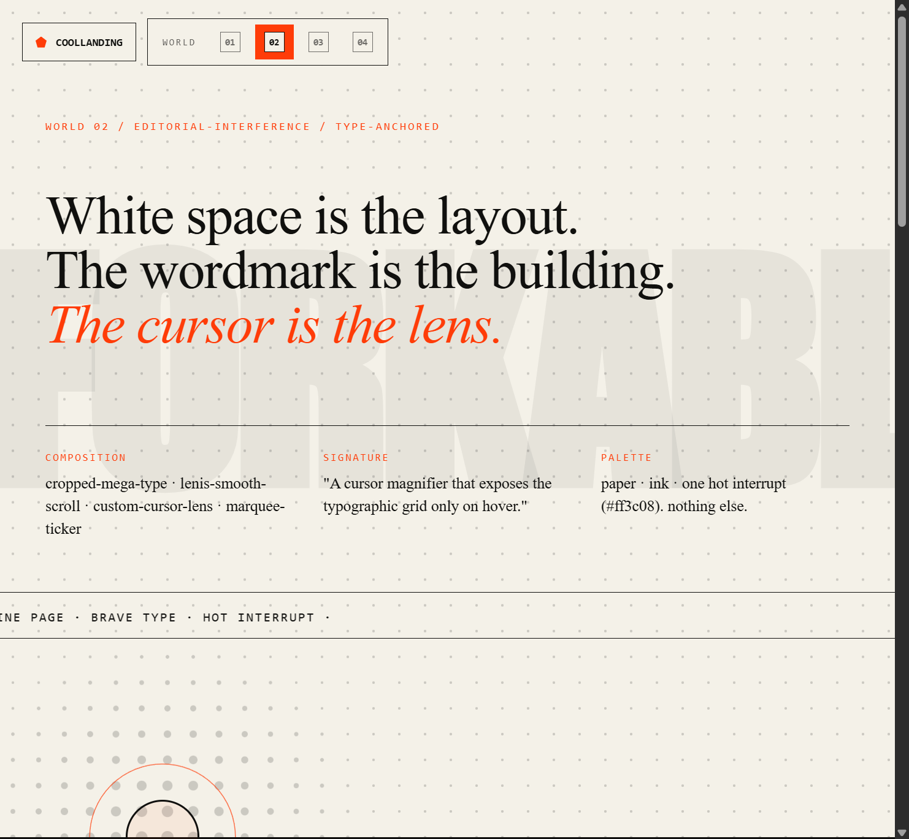
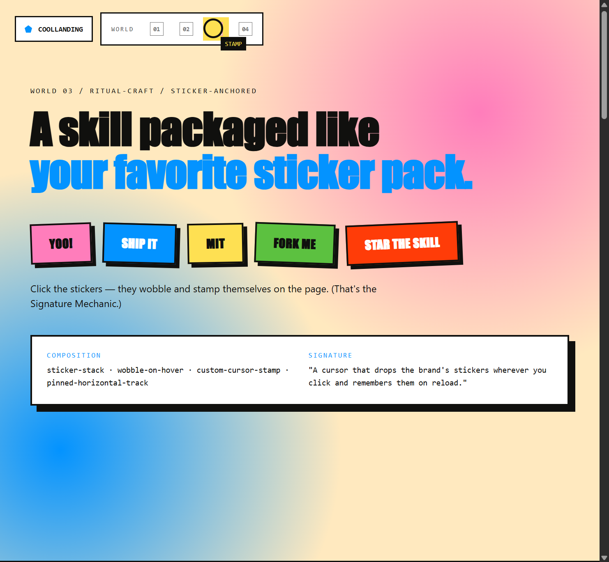
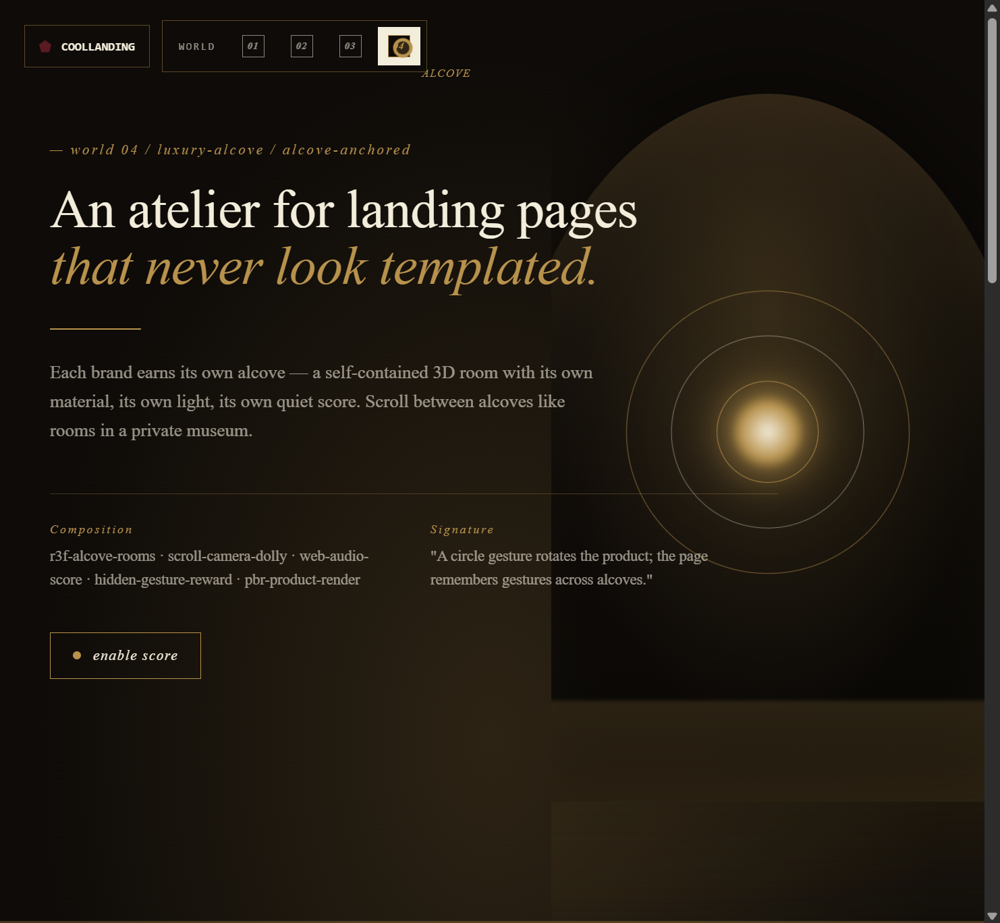
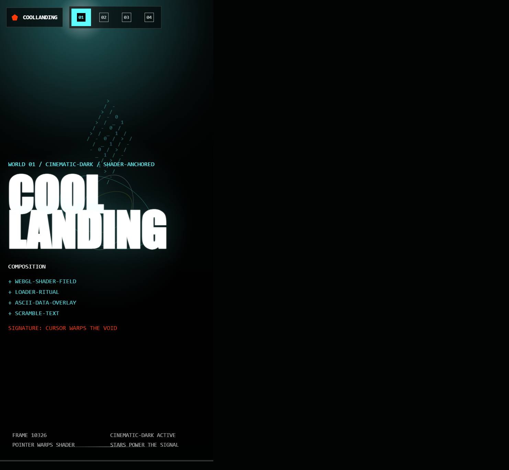

# CoolLanding

**CoolLanding 是一个开源的多世界 Live Demo 加反模板（anti-template）框架，用来做每一个品牌都独一无二的 Landing Page，而不是套模板。**

这个站本身就是一个**多世界切换器**——顶部导航能在 8 种完全不同的视觉语言之间切换，整个页面的色板、字体、动效、背景渲染器、光标、签名机制都会一起变。它存在的目的是证明配套的 [CoolLanding Skill](https://github.com/veithly/CoolLanding-Skill) 是一个**框架**，不是一个模板。

如果这个 skill 对你有帮助，欢迎去 [CoolLanding Skill 仓库点 Star](https://github.com/veithly/CoolLanding-Skill)。Star 越多，越容易被其他需要酷炫 Landing Page 的人看到。

[在线预览](https://veithly.github.io/CoolLanding/) · [Skill 仓库](https://github.com/veithly/CoolLanding-Skill) · [English README](README.md)

## 预览

世界 01 — **Cinematic Dark**（Sidewave / Active Theory）：



世界 02 — **Editorial Interference**（Blit Studio）：



世界 03 — **Ritual Craft**（Remote Rituals）：



世界 04 — **Luxury Alcove**（Cartier Watches & Wonders）：



移动端会保留每个世界的性格，同时避免横向溢出：



## 为什么做这个

很多 AI 生成的 Landing Page 会停在渐变、玻璃卡片、空泛文案。真正高级的参考网站不是这样做的：

- 它们把浏览器当成实时舞台。
- 它们用滚动控制场景。
- 它们让字体本身成为构图。
- 它们把留白、尺度、光标、动效和素材放进同一个系统。
- 它们每一个都只选**一种**强烈的视觉语言并坚持下去。不是把三种平均掉。

CoolLanding 是一个尽量轻量、可 fork、无框架依赖的参考实现。Demo 本身就是「一个 skill 能输出 8 个完全不同的世界」的运行时证据。

## 8 个风格世界（Demo 全部实装）

配套 skill 定义了 8 个风格世界，8 个都作为可切换的 live demo 内置进了本站：

| # | 世界 | Demo 是否实装 | 灵感来源 |
|---|------|--------------|--------|
| 01 | cinematic-dark | 是 | Sidewave, Active Theory |
| 02 | editorial-interference | 是 | Blit Studio |
| 03 | ritual-craft | 是 | Remote Rituals |
| 04 | luxury-alcove | 是 | Cartier Watches & Wonders |
| 05 | spatial-architecture | 是 | AIR Center |
| 06 | festival-kinetic | 是 | Razorpay Sprint 26 |
| 07 | papercraft-tactile | 是 | Aimee's Papercraft World |
| 08 | generative-system | 是 | 自定义 |

完整目录见 skill 仓库的 [`style-worlds.md`](https://github.com/veithly/CoolLanding-Skill/blob/main/skill/coollanding/references/style-worlds.md)。每一个世界都有自己的色彩逻辑、字体系统、动效语法、布局语法、素材策略和推荐机制列表。

## 参考研究（共 8 个站）

设计框架来自对这些网站的实看与拆解：

- [Sidewave](https://sidewave.it/#origin) — 黑场、WebGL2 origin 物体、loading 仪式、极少系统文字。
- [Active Theory](https://activetheory.net/) — 稀疏 DOM、WebGL2 舞台、视频和运行时资源、ASCII 纹理。
- [Blit Studio](https://blit.studio/) — 白场 editorial、巨大裁切字体、自定义光标、媒体拼贴。
- [Remote Rituals](https://remote-rituals.framer.website/) — 高饱和玩具感、Framer/SVG 密度、固定横向场景。
- [AIR Center](https://aircenter.space/) — 2D↔3D↔2D RenderTarget 切换、水面反射、全景玻璃。
- [Razorpay Sprint 26](https://razorpay.com/sprint/26) — 100+ scroll/click 触发、章节索引、B2B 当消费品讲。
- [Aimee's Papercraft World](https://aimees-papercraft-world.com/) — 角色沿路径走、烘焙 2D 到 3D 的 scrollytelling。
- [Cartier Watches & Wonders](https://www.cartier.com/en-fr/watchesandwonders) — 六个梦境 3D 壁龛、隐藏手势、Web Audio 配乐。

详细拆解见 [docs/reference-analysis.zh-CN.md](docs/reference-analysis.zh-CN.md) 和 skill 的 [`reference-sites.md`](https://github.com/veithly/CoolLanding-Skill/blob/main/skill/coollanding/references/reference-sites.md)。

## Demo 特性

- **可切换世界**：顶部导航在 8 种完全不同的视觉语言间切换，共享一个 DOM。
- **世界 01 — Cinematic Dark**：WebGL2 fragment shader 配 pointer/scroll/time uniforms，loader 仪式，ASCII data 纹理，scramble 标题，系统状态条。
- **世界 02 — Editorial Interference**：paper 白场，巨大裁切的 "FORKABLE" 字标，斜体衬线标题配 hot-orange 中断色，halftone canvas + 光标透镜，不对称杂志拼贴，marquee 跑马灯。
- **世界 03 — Ritual Craft**：饱和的粉/蓝/黄面板，带偏移阴影 + 摆动的贴纸堆，**签名机制：贴纸盖章**（点击贴纸，它会在屏幕上盖一个章，并且 reload 之后还保留），用桌面窗口元素当 UI 隐喻的固定横向滚动面板。
- **世界 04 — Luxury Alcove**：暗色精致的 atelier，brass + ivory + oxblood 色板，斜体衬线字，发光的同心环壁龛，金色尘埃粒子，**Web Audio drone 配乐**开关，三个编号的壁龛房间（I. II. III.）配材质样本。
- **世界 05 — Spatial Architecture**：axonometric canvas、CSS 3D 堆叠体块、滚动水线、镜像反射层、proximity index、pointer tilt / auto-orbit 开关。
- **世界 06 — Festival Kinetic**：章节索引、巨型 kinetic type、可随指针倾斜的实体 pass 锚定物、ticket metadata、quote beat、高饱和编号卡片网格。
- **世界 07 — Papercraft Tactile**：分层纸景、sticky scroll path、角色 traveler、纸张纹理、章节步骤、手工触感卡片。
- **世界 08 — Generative System**：seeded canvas flow-field、参数侧栏、URL seed state、shuffle/copy/export 控件、实时粒子/FPS readout。
- 自定义光标随世界自适应（mix-blend-mode difference / 橘色透镜 / 黄色盖章 / 黄铜小点）。
- 通过 `localStorage` 持久化当前世界；音频默认关闭以符合可访问性。
- 全世界支持 `prefers-reduced-motion`。
- 移动端每个世界都堆叠 fallback，不会横向溢出。

## 项目结构

```text
CoolLanding/
├── index.html              # 多世界 DOM
├── styles.css              # 基础 + 每个世界的主题
├── main.js                 # 世界切换器 + canvas/WebGL 渲染器 + 签名机制
├── assets/
│   └── generated/          # 各世界用到的位图素材
├── docs/
│   ├── reference-analysis.md
│   └── screenshots/
├── README.md
├── README.zh-CN.md
└── LICENSE
```

## 本地运行

```bash
python -m http.server 5174 --bind 127.0.0.1
```

打开 `http://127.0.0.1:5174/`，点顶部 nav 的世界按钮切换。

## 配套 Skill

网站是最终效果，skill 是可复用的制作方法。

当你想让 agent 做出一个真正独一无二的 Landing Page，可以使用 [CoolLanding Skill](https://github.com/veithly/CoolLanding-Skill)。skill 会让 agent 诊断品牌、选风格世界、配机制、发明签名机制、做实现、跑反模板审计。

```text
用 CoolLanding 给 <品牌> 做一个 launch page。
先诊断品牌，挑一个风格世界，配 2-4 个机制，
发明一个只属于这个品牌的签名机制，生成项目内素材，
实际写出来，交付前跑反模板审计。
```

如果你觉得这个方向有用，欢迎给 skill 仓库点 Star：

```text
https://github.com/veithly/CoolLanding-Skill
```

## 验证结果

当前 QA 覆盖：

- 每个世界的桌面 + 移动端截图。
- 世界切换器：切换正常、刷新后保留状态。
- WebGL2 cinematic-dark 渲染：canvas 非空像素检查。
- Editorial halftone canvas：hover 时光标透镜可见。
- Ritual 贴纸盖章：点击后生成 + 动画 + localStorage 持久化。
- Luxury Web Audio：用户手势触发，音量平滑渐入。
- 无 console 错误、无横向溢出、无文字重叠。
- `prefers-reduced-motion` 关闭重度动画。

最新验证结果（无头浏览器跑过 1024px 桌面 + 414px 移动两个视口）：

```text
世界 01 (cinematic-dark)        通过  WebGL2 着色器、ASCII 数据云、Cool Landing 巨字、标题正文不重叠
世界 02 (editorial-interference) 通过  纸张纹理、FORKABLE 鬼影、光标透镜、跑马灯、三栏 meta
世界 03 (ritual-craft)           通过  5 张贴纸、点击 wobble、贴纸盖章签名机制持续 9 秒
世界 04 (luxury-alcove)          通过  3 圈同心环 + 黄铜核、音频开关、I/II/III 三个 alcove room
世界 05 (spatial-architecture)   通过  axonometric canvas、镜像体块、水线、proximity index
世界 06 (festival-kinetic)       通过  章节索引、kinetic pass 锚定物、跑马灯、quote、编号卡片
世界 07 (papercraft-tactile)     通过  分层纸景、scroll-path traveler、active chapter steps
世界 08 (generative-system)      通过  seeded flow field、参数控件、URL state、PNG export
持久化                            通过  data-world 在刷新后从 localStorage 恢复
移动端 (414x896)                  通过  没有横向溢出、内容自动换行、switcher 折叠成数字
控制台                            通过  无错误、无警告
```

## License

MIT.
